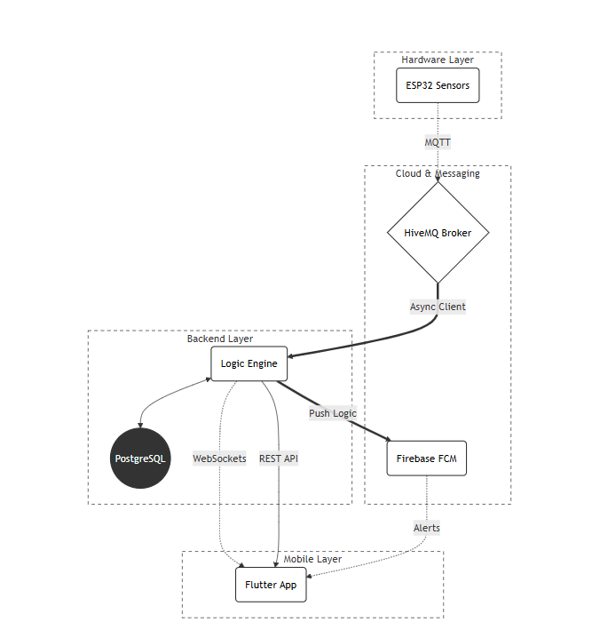

# MicroClimate Pro (Fullstack IoT System)

Интеллектуальная система мониторинга и прогнозирования микроклимата, объединяющая **IoT-устройства (ESP32)**, асинхронный **FastAPI бэкенд** и кроссплатформенное приложение на **Flutter**.

---

## 📸 Интерфейс приложения (Screenshots)

| 🔐 Login Screen | 📊 Dashboard | 📈 Smart Forecasting |
| :---: | :---: | :---: |
|  |  |  |

| 📜 History | 🛠 Profiles | 🔔 Push Alerts |
| :---: | :---: | :---: |
|  |  |  |

---

## 🏗 Архитектура системы (System Architecture)

Проект построен на событийно-ориентированной архитектуре (EDA), что обеспечивает минимальные задержки и высокую масштабируемость.



---

##  Математическая модель прогнозирования

В системе реализовано **двойное экспоненциальное сглаживание (метод Хольта)** для анализа временных рядов и прогнозирования.

### Параметры модели

* **α = 0.9** — сглаживание уровня (быстрая реакция на изменения)  
* **β = 0.1** — сглаживание тренда (подавление шума)  
* **History Window:** 1000 точек (~1.4 часа при шаге 5 секунд)  
* **Прогноз:** 30 минут / 3 часа / 24 часа  

### Алгоритм работы

1.  **MQTT Ingestion** — приём данных с датчиков.
2.  **Trend Analysis** — вычисление уровня и наклона тренда.
3.  **Forecast** — линейная экстраполяция значений.
4.  **Verification** — проверка точности прогнозов (`_hourly_verify`).

---

## 🛡️ Безопасность и мониторинг

* 🚨 **Emergency Alerts:**
    * Температура > 60°C → риск пожара.
    * CO > 100 ppm → опасная концентрация газа.
* 🔔 **Push Notifications:** Мгновенные уведомления через Firebase Cloud Messaging.
* 🔐 **JWT Authentication:** Безопасный контроль доступа и владения устройствами.

---

## 🛠 Технологический стек

### Backend
* Python 3.12 (FastAPI)
* PostgreSQL
* MQTT (Paho)
* WebSocket

### Mobile
* Flutter (Dart)
* Dio (Networking)
* Provider (State Management)

### DevOps
* Docker & Docker Compose
* Firebase FCM
* GitHub Actions

---

##  Быстрый запуск

### Backend
```bash
cd backend
docker-compose up -d
````

### Mobile App

```bash
cd mobile_app_microclimate
flutter pub get
flutter run
```

-----

## 📂 Структура проекта

  * `backend/` — Серверная часть и логика прогнозирования.
  * `mobile_app_microclimate/` — Кроссплатформенное Flutter приложение.
  * `assets/screenshots/` — Графические материалы и архитектурная схема.

-----

## 💡 Возможности системы

  * 📡 **Реальное время:** Передача данных через WebSocket.
  * 📈 **Умный прогноз:** Математическое предсказание климата.
  * 🚨 **Аварийный мониторинг:** Система уведомлений о ЧС.
  * 📊 **Аналитика:** История измерений за любой период.
  * 🔧 **Профили:** Настройка порогов под разные типы помещений.

-----

## 👨‍💻 Автор

**Shirinshoh Badalov**

