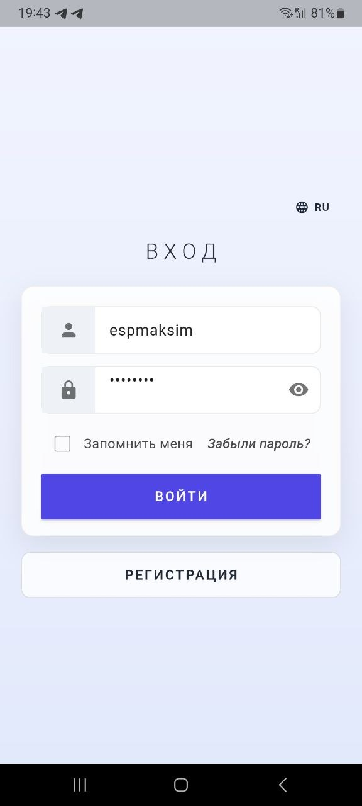
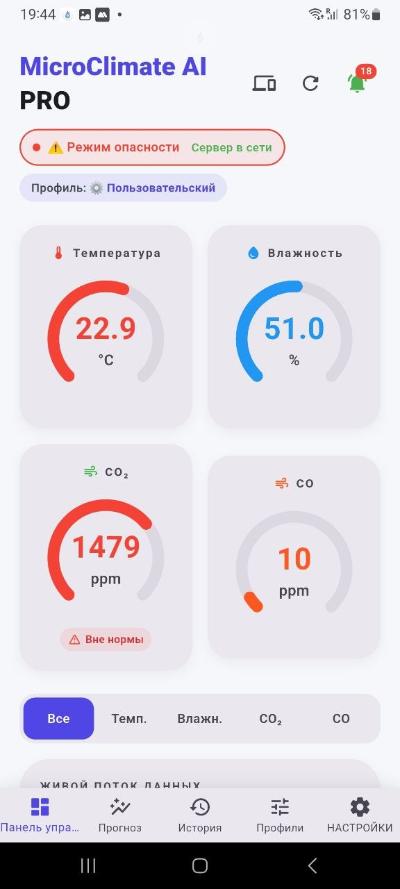
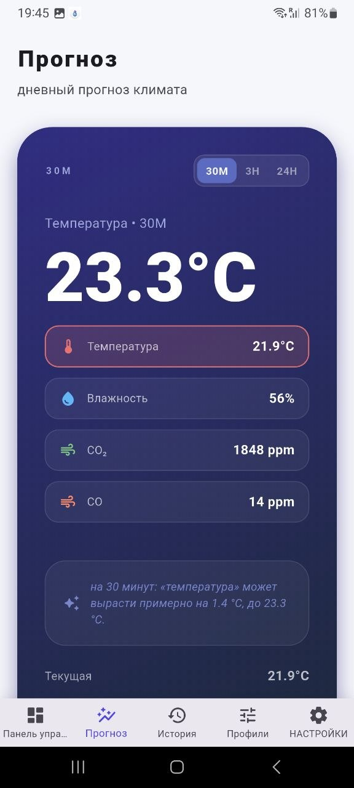
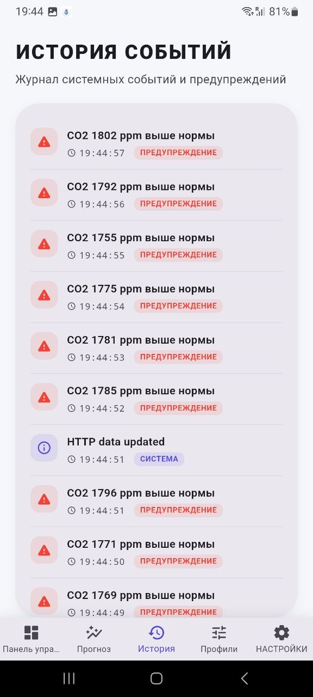
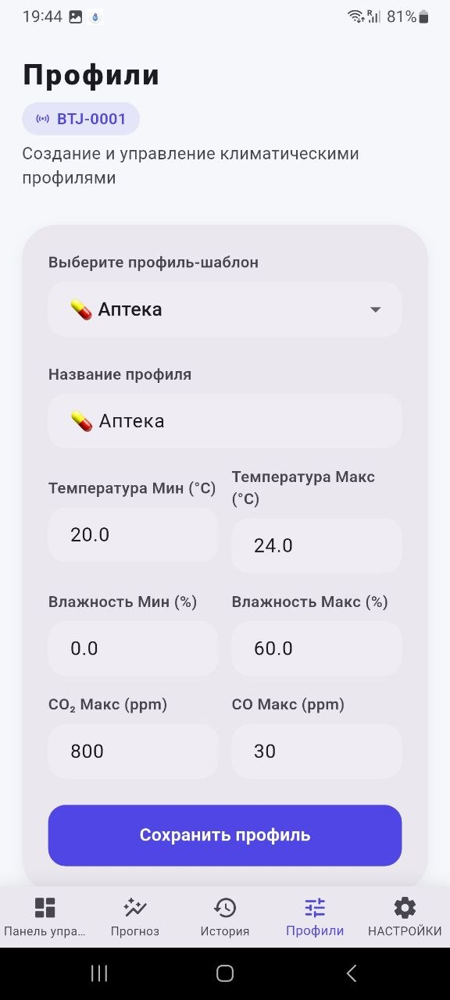
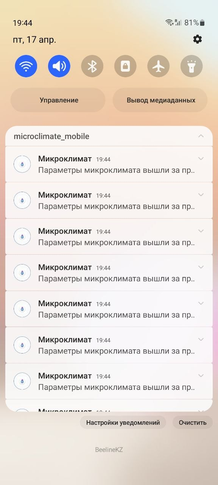
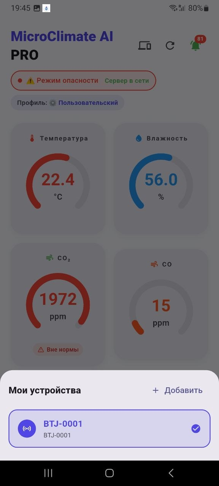
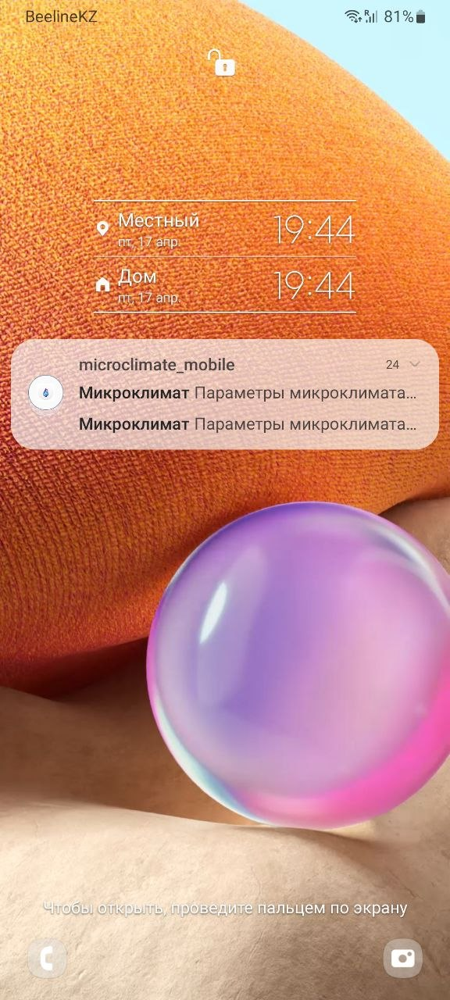

# 🌡️ MicroClimate Pro (Fullstack IoT System)

Комплексная система мониторинга и прогнозирования микроклимата, объединяющая **IoT-устройства (ESP32)**, **FastAPI бэкенд** и **Flutter приложение**.

---

## 📸 Интерфейс приложения (Screenshots)

|                🔐 Login                |                  📊 Dashboard                  |                    📈 Forecast                   |
| :------------------------------------: | :--------------------------------------------: | :----------------------------------------------: |
|  |  |  |

|                 📜 History                 |                  🛠 Profiles                 |                🔔 Push               |
| :----------------------------------------: | :------------------------------------------: | :----------------------------------: |
|  |  |  |

|                   ➕ Add Device                  |               📱 Firebase FCM               |
| :---------------------------------------------: | :-----------------------------------------: |
|  |  |

---

## ❓ Зачем нужен этот проект

Обычные датчики просто показывают данные. **MicroClimate Pro** делает больше:

* 📊 Прогнозирует значения (до 24 часов вперёд)
* 🚨 Обнаруживает опасные ситуации (пожар, CO, CO₂)
* 📱 Уведомляет пользователя в реальном времени
* ⚙️ Позволяет управлять профилями и порогами

📍 Применение:

* Умные теплицы
* Серверные
* Дома и квартиры
* Производство

---

## 🏗 Архитектура

```
ESP32 → MQTT → FastAPI → PostgreSQL
                     ↓
              WebSocket / REST
                     ↓
               Flutter App
                     ↓
              Firebase FCM
```

---

## ⚙️ Функционал

### Backend

* FastAPI REST API
* WebSocket (реальное время)
* MQTT интеграция
* JWT авторизация
* Push (FCM)

### AI

* Holt-Winters прогнозирование
* Анализ временных рядов
* Проверка точности

### Mobile

* Реальное время
* История
* Уведомления

---

## 🛠 Технологии

**Backend:** FastAPI, PostgreSQL, MQTT, WebSocket

**Frontend:** Flutter, Dio

**DevOps:** Docker, Firebase

---

## 🚀 Запуск

### Backend

```bash
docker-compose up -d
```

### Frontend

```bash
flutter pub get
flutter run
```

---

## 📁 Структура

```
backend/
mobile_app_microclimate/
assets/screenshots/
```

---

## 👨‍💻 Автор

Shirinshoh Badalov

